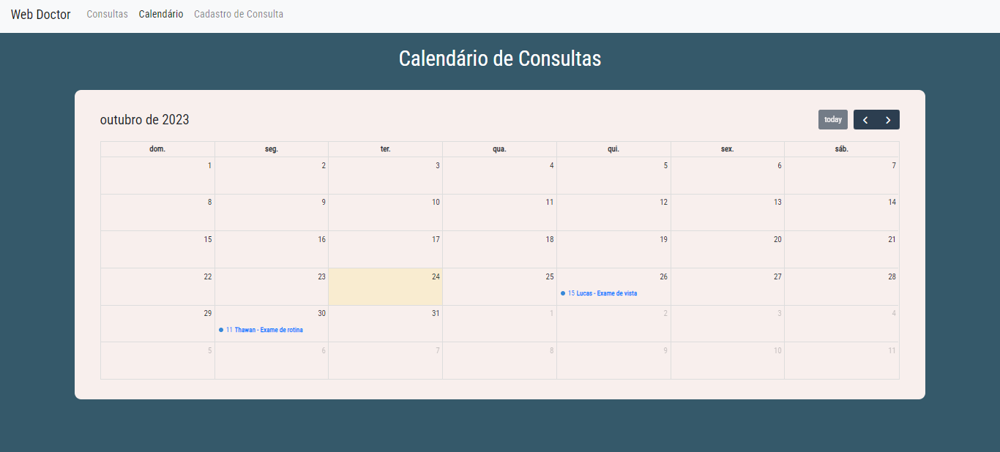

# Web Doctor

# Sobre o Projeto
Esse foi um projeto pensando para atender empresas e lojas que nescessitam de agendamento, a base de agendamento poderia ser a mesma para uma barbearia ou qualquer outro nicho de mercado que necessite agendar, só que para esse projeto eu fiz para uma hospital, nele é usado a biblioteca full calendar, e no projeto você consegue agendar consultas, fazer consultas simples por cpf ou email, e também é capaz de enviar email para os clientes automaticamente quando faltasse 1 hr para a consulta.

## Layout do projeto
 .png>) .png>)
## Back end
- Node.JS
- MongoDB
- Express
- Mongoose
## Front end (Template Engine)
- ejs
- Bootstrap

## Como executar o projeto
### `npm run start` 
Executar app no modo de desenvolvimento.
Abra [http://localhost:8080](http://localhost:8080) para visualizar em seu navegador.